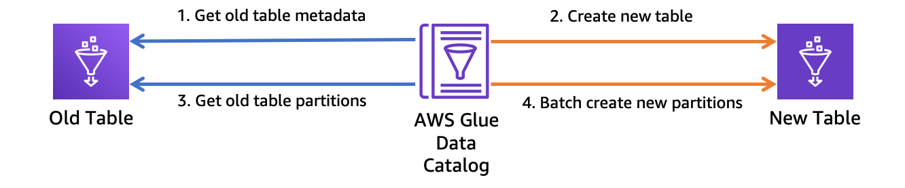

### Rename AWS Glue Table
Sometimes you might need to rename an AWS Glue table, and add corresponding partitions.

As AWS Glue currently does not provide the table rename feature, the user need to leverage the Glue API to make a new table for the workaround. Besides, if only to copy the table metadata, it will lose the partition information, so the partitions also need "migrated" to the new table.  



### Usage
The usage of the code is quite simple, just provide your database and table names, plus the region used.

```
python rename_table.py --database-name <db name> --old-table-name <old table name> --new-table-name <new table name> --region-name <region>
```
